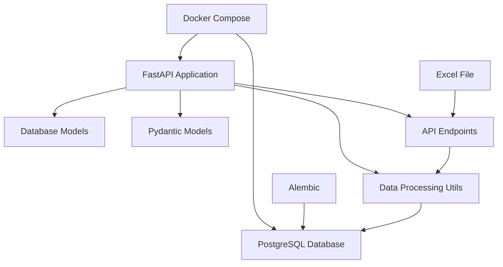
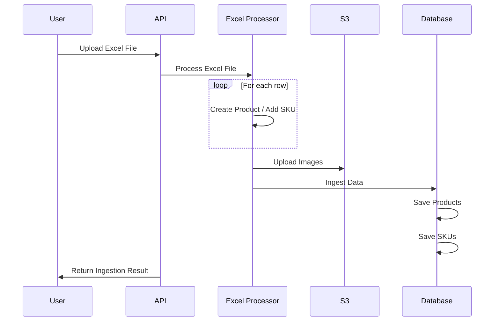

# Briskk Data Ingestion Assignment

This project is a FastAPI-based application for ingesting product data from Excel files into a PostgreSQL database. It includes functionality for processing images, uploading them to S3, and storing product and SKU information.

## Sys Design


## Data Ingestion Flow


## Setup Instructions
1. Ensure you have Docker and Docker Compose installed on your system.
2. Clone the repository and navigate to the project directory.
3. Create a `.env` file in the root directory with the following content:
```bash
DATABASE_URL=postgresql+asyncpg://user:password@db:5432/product_db
S3_BUCKET=briskk-data-ingestion
```
4. Build and start the Docker containers:
```bash
docker compose up --build
```

## Using Alembic for Database Migrations

1. Initialize Alembic (if not already done):
```bash
alembic init alembic
```
2. Create a new migration:
```bash
alembic revision --autogenerate -m "Description of changes"
```
3. Apply migrations:
```bash
alembic upgrade head
```
4. To revert migrations:
```bash
alembic downgrade -1
```

> Note: Make sure to run these commands in the project's root directory, where the `alembic.ini` file is located.

## How to run
1. The application will be available at `http://localhost:8000`.
2. To ingest data, use the `/ingest` endpoint:
    - Send a POST request to `http://localhost:8000/ingest`
    - Include an Excel file in the request body with the key: `file`
3. To retrieve ingested products, use the `/products` endpoint:
    - Send a GET request to `http://localhost:8000/products`
4. To run tests:
    - `docker compose run --rm test`
5. To access the API documentation, visit `http://localhost:8000/docs` in your browser.

> Note: The current setup uses a simulated S3 upload process. For production use, you'll need to implement actual S3 integration.
